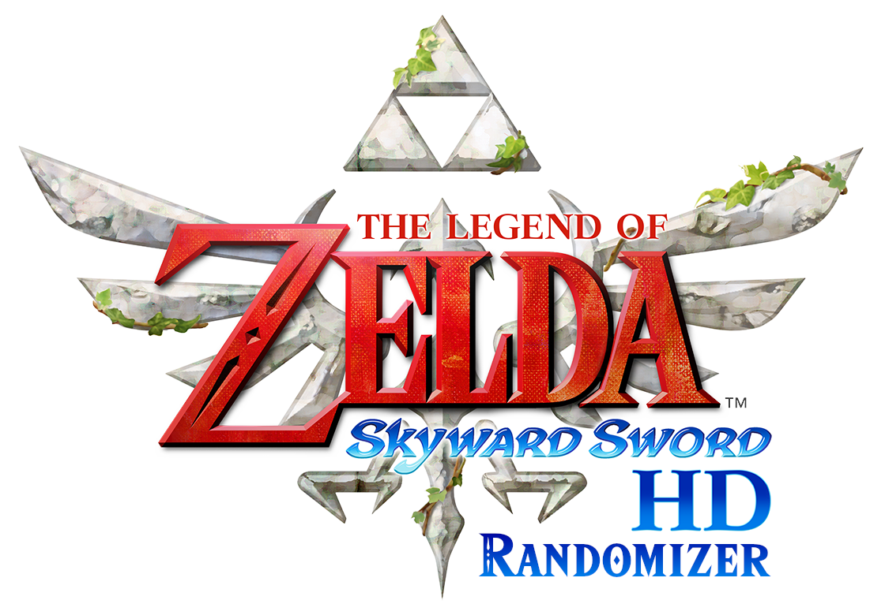

  

  
  

<h2 align="center">
  <a href="https://github.com/mint-choc-chip-skyblade/sshd-rando/releases">🎲 Download the latest version of the Randomizer here! 🎲</a>
</h2>

# What is Legend of Zelda: Skyward Sword HD Tweaks?

Basically, "Better SSHD".
